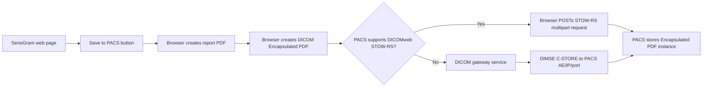
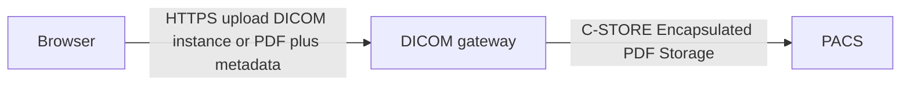

# ADR 0001: Print Web Page to DICOM Encapsulated PDF and Store to PACS

## Status

Proposed

## Context

Users need a button on the SenoGram demo web page that captures the reportable page content as a PDF, wraps that PDF in a DICOM Encapsulated PDF instance, and stores it to a DICOM PACS server.

The initial source page is:

https://senomedical.com/senogram/demo/

Assumptions:

- The page includes the minimum patient metadata required by this workflow:
  - PatientID
  - PatientName
  - PatientBirthDate
- The PACS host and port are known.
- The saved content should represent a report view of the page, not transient browser chrome or interactive-only controls.
- A client-side action is preferred where technically possible.

Browser JavaScript can generate PDFs and make HTTPS requests, but it cannot open arbitrary TCP sockets to perform classic DICOM DIMSE C-STORE directly to a PACS AE. Therefore, a fully client-side architecture is only possible when the destination exposes a DICOMweb STOW-RS endpoint that is reachable from the browser and allows the required CORS, TLS, and authentication configuration.

DICOM Encapsulated PDF Storage uses SOP Class UID `1.2.840.10008.5.1.4.1.1.104.1`. The encapsulated document MIME type is `application/pdf`.

## Decision

Use a browser-first architecture with a gateway fallback:

1. The SenoGram page exposes a `Save to PACS` action.
2. The browser builds a deterministic report PDF from a controlled report view.
3. The browser wraps the PDF bytes in a DICOM Encapsulated PDF object.
4. If the PACS supports DICOMweb STOW-RS, the browser stores the DICOM instance directly over HTTPS.
5. If the PACS only supports classic DICOM networking, the browser sends the generated payload to a gateway service, and the gateway performs DIMSE C-STORE to the PACS.

## Architecture



## Client-Side Workflow

1. User presses `Save to PACS`.
2. Browser gathers patient metadata:
   - `PatientID`
   - `PatientName`
   - `PatientBirthDate`
3. Browser gathers report/scoring state and page provenance:
   - SenoGram scoring values
   - rendered result/probability state
   - source page URL
   - export timestamp
4. Browser renders a PDF from a controlled report DOM or report model.
5. Browser creates a DICOM Encapsulated PDF instance.
6. Browser sends the instance to PACS using DICOMweb STOW-RS when available.

The PDF should be generated from a controlled report view rather than using `window.print()`. Browser print dialogs do not reliably expose generated PDF bytes back to JavaScript.

Acceptable browser PDF generation approaches:

- Preferred: build a structured PDF directly using a library such as `pdf-lib` or `jsPDF`.
- Acceptable: render a controlled DOM report view to an image using a library such as `html2canvas` or `html-to-image`, then place that image into a PDF.

## DICOMweb Storage

When DICOMweb is available, use STOW-RS:

```text
POST {DICOMWEB_BASE}/studies/{StudyInstanceUID}
Content-Type: multipart/related; type="application/dicom"; boundary={boundary}
```

The multipart body contains one DICOM PS3.10 binary instance:

```text
Content-Type: application/dicom
```

The browser implementation must account for:

- CORS configuration on the DICOMweb endpoint.
- HTTPS requirements.
- Authentication and authorization.
- PACS acceptance of Encapsulated PDF Storage.
- PACS behavior when storing a new study versus attaching to an existing study.

## Gateway Storage

When the PACS only exposes classic DICOM DIMSE networking, use a gateway:



The gateway should:

- Receive either a complete DICOM instance or PDF bytes plus metadata.
- Validate required metadata.
- Generate or preserve DICOM UIDs as appropriate.
- Add institution, device, or source metadata if required by deployment policy.
- Negotiate Encapsulated PDF Storage with the PACS.
- Send the object using DIMSE C-STORE.
- Return a clear success or failure result to the browser.

The gateway keeps PACS AE titles, credentials, network rules, and C-STORE behavior out of browser JavaScript.

## Minimum DICOM Attributes

The generated DICOM instance should include at least:

```text
SOPClassUID = 1.2.840.10008.5.1.4.1.1.104.1
SOPInstanceUID = newly generated UID
StudyInstanceUID = existing study UID or newly generated UID
SeriesInstanceUID = newly generated UID
Modality = DOC
PatientID = provided
PatientName = provided
PatientBirthDate = provided
StudyDate = export date
StudyTime = export time
SeriesDate = export date
SeriesTime = export time
InstanceNumber = 1
DocumentTitle = SenoGram Report
MIMETypeOfEncapsulatedDocument = application/pdf
EncapsulatedDocument = PDF bytes
Manufacturer = Seno Medical
BurnedInAnnotation = YES, if patient-identifying text appears inside the PDF
```

If the PDF is intended to attach to an existing imaging study, the workflow must use that study's `StudyInstanceUID`. Otherwise, it should create a new study and preserve the generated UID in the success response/logs.

## Consequences

Benefits:

- Supports the preferred client-side user interaction.
- Allows a direct browser-to-PACS path when DICOMweb STOW-RS is available.
- Preserves compatibility with traditional PACS deployments through a small gateway.
- Produces a standard DICOM Encapsulated PDF object that can be stored, queried, and retrieved like other DICOM objects.

Tradeoffs:

- A pure browser implementation is not possible for classic DIMSE-only PACS endpoints.
- Direct DICOMweb storage requires CORS, HTTPS, and authentication support from the PACS or DICOMweb proxy.
- PDF rendering must be deterministic and validated so exported reports match clinical expectations.
- PACS support for Encapsulated PDF Storage must be verified during integration.

## Open Questions

- Should exports create a new study or attach to an existing study?
- What Study Description, Series Description, Accession Number, Referring Physician, and Institution fields are required by the target PACS workflow?
- Which browser PDF generation library should be standardized?
- Should the browser create the DICOM object, or should the gateway always create it for stronger validation?
- What audit logging and user identity requirements apply?

## References

- DICOM Encapsulated PDF Storage SOP Class UID: `1.2.840.10008.5.1.4.1.1.104.1`
- DICOM Encapsulated PDF IOD: https://dicom.innolitics.com/ciods/encapsulated-pdf
- DICOM STOW-RS Store Instances: https://dicom.nema.org/medical/dicom/2018d/output/html/part18.html
- DICOM PDF encapsulation supplement: https://dicom.nema.org/medical/dicom/final/sup104_ft.pdf
